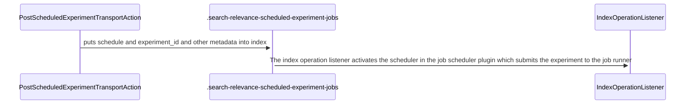
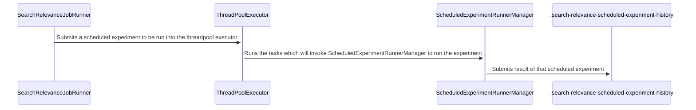
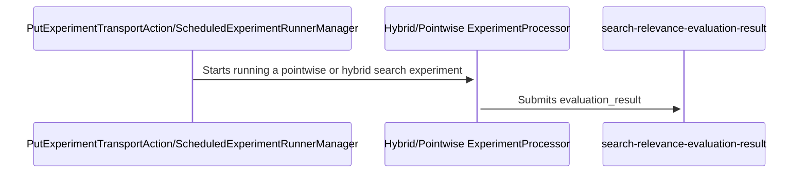

- [Developer Guide](#developer-guide)
    - [Getting Started](#getting-started)
        - [Fork OpenSearch search-relevance Repo](#fork-opensearch-search-relevance-repo)
        - [Install Prerequisites](#install-prerequisites)
            - [JDK 21](#jdk-21)
            - [Environment](#Environment)
    - [Use an Editor](#use-an-editor)
        - [IntelliJ IDEA](#intellij-idea)
    - [Build](#build)
    - [Run OpenSearch search-relevance](#run-opensearch-search-relevance)
        - [Run Single-node Cluster Locally](#run-single-node-cluster-locally)
        - [Run SRW in Demo Mode](#run-srw-in-demo-mode)
        - [Run remote cluster](#run-remote-clusters-with-search-relevance)
    - [Debugging](#debugging)

# Developer Guide

## Getting Started
Please define the OpenSearch version in `build.gradle`. By default, we're developing with `3.1.0-SNAPSHOT`

### Fork OpenSearch search-relevance Repo

Fork this repository on GitHub, and clone locally with `git clone`.

Example:
```
git clone https://github.com/[your username]/search-relevance.git
```

### Install Prerequisites

#### JDK 21

OpenSearch builds using Java 21 at a minimum. This means you must have a JDK 21 installed with the environment variable
`JAVA_HOME` referencing the path to Java home for your JDK 21 installation, e.g. `JAVA_HOME=/usr/lib/jvm/jdk-21`.

One easy way to get Java 21 on *nix is to use [sdkman](https://sdkman.io/).

```bash
curl -s "https://get.sdkman.io" | bash
source ~/.sdkman/bin/sdkman-init.sh
sdk install java 21.0.2-open
sdk use java 21.0.2-open
``````

JDK versions 21 and 24 were tested and are fully supported for local development.

## Use an Editor

### IntelliJ IDEA

When importing into IntelliJ you will need to define an appropriate JDK. The convention is that **this SDK should be named "11"**, and the project import will detect it automatically. For more details on defining an SDK in IntelliJ please refer to [this documentation](https://www.jetbrains.com/help/idea/sdk.html#define-sdk). Note that SDK definitions are global, so you can add the JDK from any project, or after project import. Importing with a missing JDK will still work, IntelliJ will report a problem and will refuse to build until resolved.

You can import the OpenSearch project into IntelliJ IDEA as follows.

1. Select **File > Open**
2. In the subsequent dialog navigate to the root `build.gradle` file
3. In the subsequent dialog select **Open as Project**

## Java Language Formatting Guidelines

Taken from [OpenSearch's guidelines](https://github.com/opensearch-project/OpenSearch/blob/main/DEVELOPER_GUIDE.md):

Java files in the OpenSearch codebase are formatted with the Eclipse JDT formatter, using the [Spotless Gradle](https://github.com/diffplug/spotless/tree/master/plugin-gradle) plugin. The formatting check can be run explicitly with:

    ./gradlew spotlessJavaCheck

The code can be formatted with:

    ./gradlew spotlessApply

## Build

OpenSearch search-relevance uses a [Gradle](https://docs.gradle.org/current/userguide/userguide.html) wrapper for its build.
Run `gradlew` on Unix systems.

Build OpenSearch search-relevance using `gradlew build`

```
./gradlew build
```

## Run OpenSearch search-relevance

### Run Single-node Cluster Locally
Run OpenSearch search-relevance using `gradlew run`.

```shell script
./gradlew run
```
That will build OpenSearch and start it, writing its log above Gradle's status message. We log a lot of stuff on startup, specifically these lines tell you that plugin is ready.
```
[2023-10-24T16:26:24,789][INFO ][o.o.h.AbstractHttpServerTransport] [integTest-0] publish_address {127.0.0.1:9200}, bound_addresses {[::1]:9200}, {127.0.0.1:9200}
[2023-10-24T16:26:24,793][INFO ][o.o.n.Node               ] [integTest-0] started
```

It's typically easier to wait until the console stops scrolling, and then run `curl` in another window to check if OpenSearch instance is running.

```bash
curl localhost:9200

{
  "name" : "integTest-0",
  "cluster_name" : "integTest",
  "cluster_uuid" : "XSMfCO3FR8CBzRnhG1AC7w",
  "version" : {
    "distribution" : "opensearch",
    "number" : "3.0.0-SNAPSHOT",
    "build_type" : "tar",
    "build_hash" : "5bd413c588f48589c6fd6c4de4e87550271aecf8",
    "build_date" : "2023-10-24T18:06:58.612820Z",
    "build_snapshot" : true,
    "lucene_version" : <lucene-version>,
    "minimum_wire_compatibility_version" : "2.12.0",
    "minimum_index_compatibility_version" : "2.0.0"
  },
  "tagline" : "The OpenSearch Project: https://opensearch.org/"
}
```
### Run SRW in Demo Mode
1. Run OpenSearch search-relevance using `gradlew run`.
```shell script
./gradlew run
```
2. Run the script `src/test/scripts/demo.sh` to see the full process of creating new UBI indexes loaded with sample data as well as the "sample" ecommerce index.
```shell script
src/test/scripts/demo.sh
```

### Run SRW in Hybrid Search Optimizer Demo Mode
1. Run OpenSearch search-relevance using `gradlew run`.
```shell script
./gradlew run
```
2. Run the script `src/test/scripts/demo_hybrid_optimizer.sh` to see the full process of setting up OpenSearch and indexing data with embeddings to run not only keyword but also hybrid search queries with the "sample" ecommerce index.
```shell script
src/test/scripts/demo_hybrid_optimizer.sh
```

### Run remote clusters with search-relevance
1. Create a `docker-compose.yml` file with two OpenSearch clusters, for example
```
services:
  opensearch_search_relevance:
    image: opensearch/opensearch:3.1.0
    container_name: opensearch_search_relevance
    environment:
      discovery.type: single-node
      node.name: opensearch
      cluster.name: opensearch_search_relevance
      bootstrap.memory_lock: true
      DISABLE_INSTALL_DEMO_CONFIG: true
      DISABLE_SECURITY_PLUGIN: true # disable security plugin only for demo
      OPENSEARCH_JAVA_OPTS: "-Xms1g -Xmx4g"

    ulimits:
      memlock:
        soft: -1
        hard: -1
      nofile:
        soft: 65536
        hard: 65536
    ports:
      - 9200:9200
      - 9600:9600 # required for Performance Analyzer
    volumes:
      - opensearch-data:/usr/share/opensearch/data
    networks:
      - opensearch-net

  opensearch-ccs-node:
    image: opensearch/opensearch:3.1.0
    container_name: opensearch-ccs-node
    environment:
      - cluster.name=opensearch-ccs-cluster
      - discovery.type=single-node
      - bootstrap.memory_lock=true
      - DISABLE_INSTALL_DEMO_CONFIG=true
      - DISABLE_SECURITY_PLUGIN=true
      - "OPENSEARCH_JAVA_OPTS=-Xms512m -Xmx512m"

    ulimits:
      memlock:
        soft: -1
        hard: -1
    volumes:
      - opensearch-css-data:/usr/share/opensearch/data
    ports:
      - 9250:9200
      - 9800:9600 # required for Performance Analyzer
    networks:
      - opensearch-net

volumes:
  opensearch-data:
  opensearch-css-data:

networks:
  opensearch-net:
```
2. run command `docker compose up` to spin up the containers
3. run `docker ps` to make sure all containers are up
```
// example
CONTAINER ID   IMAGE                                          COMMAND                  CREATED       STATUS       PORTS                                                                NAMES
d988637da9a3   search-relevance-opensearch_search_relevance  "./opensearch-docker…"   2 hours ago   Up 2 hours   0.0.0.0:9200->9200/tcp, 9300/tcp, 0.0.0.0:9600->9600/tcp, 9650/tcp   opensearch_search_relevance
7c76ddf26b45   search-relevance-opensearch-ccs-node          "./opensearch-docker…"   2 hours ago   Up 2 hours   9300/tcp, 9650/tcp, 0.0.0.0:9260->9200/tcp, 0.0.0.0:9800->9600/tcp   opensearch-ccs-node
```
4. get the ip-address for remote container
```
docker inspect --format='{{range .NetworkSettings.Networks}}{{.IPAddress}}{{end}}' 7c76ddf26b45

172.18.0.2
```
5. add remote cluster to your coordinate cluster settings
```
PUT localhost:9200/_cluster/settings
{
  "persistent": {
    "cluster.remote": {
      "opensearch-ccs-cluster": {       # remote cluster name
        "seeds": ["172.18.0.2:9300"]    # remote cluster ip-address
      }
    }
  }
}
```
6. check if the remote cluster is connected
```
GET localhost:9200/_remote/info

{
	"opensearch-ccs-cluster": {
		"connected": true,              # make sure connected is true
		"mode": "sniff",
		"seeds": [
			"172.18.0.2:9300"
		],
		"num_nodes_connected": 1,
		"max_connections_per_cluster": 3,
		"initial_connect_timeout": "30s",
		"skip_unavailable": false
	}
}
```
7. if you want to run backend with dashboards-search-relevance changes. Go to `OpenSearch-Dashboards/config/opensearch_dashboards.yml`
```
#OPENSEARCH_HOSTS: ["http://opensearch_search_relevance:9200"]
```

### Debugging

Sometimes it is useful to attach a debugger to either the OpenSearch cluster or the integration test runner to see what's going on. For running unit tests, hit **Debug** from the IDE's gutter to debug the tests. For the OpenSearch cluster, first, make sure that the debugger is listening on port `5005`. Then, to debug the cluster code, run:

```
./gradlew :integTest -Dcluster.debug=1 # to start a cluster with debugger and run integ tests
```

OR

```
./gradlew run --debug-jvm # to just start a cluster that can be debugged
```

The OpenSearch server JVM will connect to a debugger attached to `localhost:5005` before starting. If there are multiple nodes, the servers will connect to debuggers listening on ports `5005, 5006, ...`

To debug code running in an integration test (which exercises the server from a separate JVM), first, setup a remote debugger listening on port `8000`, and then run:

```
./gradlew :integTest -Dtest.debug=1
```

The test runner JVM will connect to a debugger attached to `localhost:8000` before running the tests.

```
./gradlew test -Dtest.debug=1
```

This starts the unit test JVM with a JDWP debugger listening on `localhost:8000`, suspending execution until a debugger is attached.

Additionally, it is possible to attach one debugger to the cluster JVM and another debugger to the test runner. First, make sure one debugger is listening on port `5005` and the other is listening on port `8000`. Then, run:
```
./gradlew :integTest -Dtest.debug=1 -Dcluster.debug=1
```

When running integration tests, it is assumed that the [UBI Plugin](https://github.com/opensearch-project/user-behavior-insights) is installed. If the cluster does not have that plugin, use the flag `-Dubi.available=false` when running `./gradlew :integTest`.

## Design Documentation

For new features or significant changes, contributors should document their designs using the [Technical Design Template](docs/DESIGN_TEMPLATE.md). This template ensures comprehensive documentation of:

- Architecture and design decisions
- Security considerations and threat modeling
- Performance implications and benchmarking
- Testing strategies and approaches
- Backward compatibility analysis

The template is particularly valuable for:
- New API implementations
- Performance or architectural improvements
- Cross-component integrations
- Changes affecting security or backward compatibility

Refer to the [design documentation guide](docs/README.md) for detailed instructions, examples, and best practices on using the template effectively.

## Explanation on Scheduled Experiment Indices

When running a scheduled experiment, the data is stored a little bit differently compared to running an individual experiment. The information of the job that runs the experiment is stored in a separate index called, `.search-relevance-scheduled-experiment-jobs`. The information stored is the schedule (in the cron job format) and whether the job is actually running or not.

The diagram below shows how the scheduled experiment API interacts with the `.search-relevance-scheduled-experiment-jobs` index.



The results of these runs are also stored in its own index called `.search-relevance-scheduled-experiment-history`. This helps track the status of the experiment, the results, and the id of the experiment that the scheduled run is based on.

The diagram below shows the code flow behind how the data is stored into this index.



The evaluation results index `search-relevance-evaluation-result` will also be updated for viewing the scheduled experiment results in Search Relevance Dashboards. One nuance is that there will be an additional marker to indicate that the evaluation result was based on a scheduled experiment.

Below is a diagram to show how evaluation results are submitted.


